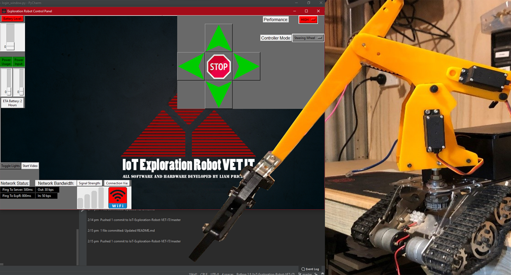

# IoT Exploration Robot: Control Panel
## School Assessed Task: VET Integrated Technologies

## Table of contents
* [General info](#general-info)
* [Technologies](#technologies)
* [Setup](#setup)

## General info
This project is developed entirely by Liam Price in order to pass the VET IT SAT. The overall function of this software is to act as a Control Panel for my Exploration Robot. The actual Arduino code that runs on the Robot is contained in another Repo here:
https://github.com/LeehamElectronics/Exploration-Robot-Arduino

### 2021 UPDATE:
#### So this project ended up winning the VCE Top Designs for VET Integrated Technologies! It is currently on display in the Melbourne Museum, you can view it here in a virtual tour: https://museumsvictoria.com.au/melbournemuseum/learning/top-designs-2021/
#### And here is a little article they posted about it: https://museumsvictoria.com.au/melbournemuseum/learning/top-designs-2021/vce-vet-programs/integrated-technologies/
#### And lastly here is an embarrassing interview they posted of me where I say 'umm' more than anything else: https://www.youtube.com/watch?v=ty_FZUM7rPA

Here is a YouTube video with a basic demonstration of the system: [YouTube Video](https://www.youtube.com/watch?v=0TiRYpMsIOc&t=27s) 

And here is a link to the engineering and design folio for this project: [Engineering Folio](https://drive.google.com/file/d/1ohp7j_BZnhxLjLv0mqf6PKU2e-KAmkB1/view?usp=sharing) 
	
## Technologies
Project is created with:
* PyCharm Community Edition
* MQTT (paho-mqtt): 1.5.0
* tkinter
	
## Setup
To run this project, download it:

```
Go To Releases
Download as ZIP
Install all the required modules from requirements.txt (should be automatic in PyCharm)
Run login_window.py or open the entire folder in your Python IDE
Alternatively download the latest commit if you want to see what stage I am up to.
```
